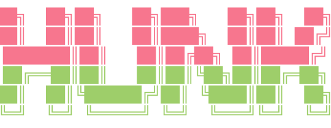

<div align="center">



**Your AI's code might be ugly. The diff won't be.**

</div>

A standalone, themeable diff viewer for the terminal. Side-by-side, word-level
highlighting, keyboard-driven — and when you run it inside a git repository, it
turns into a live review pass you can stage from, hunk by hunk.

Built for the diffs coding agents produce: large, spread across many files, and
miserable to read as raw `git diff` output.

```
┌ Files ────┬ auth/token.go ───────────────────────────────────────────────────┐
│ ● auth/…  │ @@ -18,6 +18,7 @@ func Validate(tok string) error                │
│   +12 -4  │  18 │   if tok == "" {          │ 18 │   if tok == "" {          │
│ ◐ ui/vie… │╭────────────────────────────────────────────────────────────────╮│
│   +1 -0   ││ 19 │     return ErrEmpty       → 19 │     if debug {           ││
│ · main.go │╰────────────────────────────────╮ 20 │       log(tok)           ││
│           │                                 │ 21 │     }                    ││
│           │                                 ╰───────────────────────────────╯│
│           │  20 │   }                       │ 22 │   }                       │
└───────────┴ space mark  A file  w stage  u undo  f follow  ? help  q quit ───┘
```

> Screenshots and a demo GIF: **TODO** — the ASCII sketch above is a stand-in.

## Install

```sh
go install github.com/wmarquardt/hunk@latest
```

Or build from a clone:

```sh
git clone https://github.com/wmarquardt/hunk
cd hunk
go build -o hunk .
```

Single static binary, no runtime dependencies. Git is only needed for the
working-tree review mode below.

## Usage

```sh
hunk                     # review the working tree, and stage what you approve
git diff | hunk          # read a diff from stdin
git show <sha> | hunk    # or any other diff-producing command
hunk old.txt new.txt     # diff two files, no git required
hunk old/ new/           # diff two directories
```

Output that is piped or redirected is passed through as plain unified diff, so
`hunk a b > patch.diff` does what you would expect.

### Keys

| Key | Action |
|---|---|
| `j` / `k`, ↑ / ↓ | scroll a line |
| `ctrl-d` / `ctrl-u` | scroll half a page |
| `n` / `p` | next / previous hunk |
| `]` / `[` | next / previous file |
| `g` / `G` | top / bottom |
| `/` | search the diff; `n` / `N` repeat, `esc` clears |
| `h` / `l`, ← / → | scroll sideways |
| `s` | toggle side-by-side / unified |
| `b` | toggle the file sidebar |
| `?` | help |
| `q` | quit |

In working-tree review mode you also get:

| Key | Action |
|---|---|
| `space` | mark this hunk and move to the next one in the file |
| `a` / `d` | mark / unmark, then jump to the next hunk |
| `A` / `D` | mark / unmark every hunk in this file |
| `w` | stage what is marked |
| `u` | undo the last stage |
| `f` | pause / resume following the working tree |
| `i` | ignore / show whitespace-only changes |
| `+` / `-` | more / less context around each hunk |

Marking is `git add -p` without the one-hunk-at-a-time straitjacket: see the
whole change, jump around, mark as you go, then write it all at once.

Every run of changed lines is wrapped in a rounded outline that crosses from one
pane into the other, with an arrow on the seam pointing the way the change goes.
Each pane closes on its own last changed line and the rule turns down into the
taller pane's wall, so one line becoming four draws one shape narrowing rather
than two boxes side by side — the outline itself shows the shape of the change.
Inside a line, the words that actually changed are painted a shade stronger.

hunk follows the working tree while it is open: edits made by you, your editor,
or an agent show up on their own, and marks on untouched hunks survive the
reload. `f` pauses and resumes following. Because of that, opening hunk in a
clean repository is fine — it waits, and fills in with the first change.

Staging runs `git apply --cached`, so it **only ever writes the index** — no
working-tree file is created, modified, or deleted by hunk. If you stage
something you did not mean to, `git restore --staged .` puts it back.

The side-by-side layout falls back to unified on narrow terminals, and the
sidebar hides itself when there is no room for it.

## Theming

hunk ships with two themes: `hunk-dark` (the default) and `paper` (light).

```sh
hunk --theme paper
HUNK_THEME=paper hunk
```

### Writing your own

Themes are TOML files in `~/.config/hunk/themes/` (`$XDG_CONFIG_HOME` is
honoured). A file named `midnight.toml` there is available as `--theme midnight`.

**Every key is optional.** Anything you leave out keeps the default theme's
value, so a two-line theme is a perfectly good theme. One key does a lot of
work: `ui.accent` is every highlight hunk draws — the `@@` line, the current
hunk, a change block's outline and its arrow, the status bar, the selected file
— so recoloring the highlight is a one-line edit:

```toml
# ~/.config/hunk/themes/midnight.toml
name = "midnight"

[ui]
accent = "#7aa2f7"

[diff]
added_fg   = "#7ee787"
removed_fg = "#ff7b72"
```

The full schema, with every key and what it colors, is in
[`internal/theme/builtin/hunk-dark.toml`](internal/theme/builtin/hunk-dark.toml) —
copy it and edit. Values are hex colors (`#rgb` or `#rrggbb`). A typo'd key gets
a warning, a bad color gets an error naming the key, and neither costs you your
diff: hunk falls back to the default theme and carries on.

### Themes from GitHub

Reference a theme the way Go references a module:

```sh
hunk --theme github.com/someone/hunk-themes/dracula
hunk --theme github.com/someone/hunk-themes/dracula@v1.2.0   # pin it
hunk --theme-update                                          # re-fetch
```

It resolves to `themes/<name>.toml` (or `<name>.toml`) in that repo, and is
cached under `~/.config/hunk/themes/github.com/…`. A cache hit never touches the
network, so a theme is downloaded once and hunk keeps working offline.

To publish your own, put `.toml` files in a `themes/` directory in any public
GitHub repo. That is the whole protocol.

## Not in v1

Reverting hunks in the working tree, reviewing already-staged changes,
committing from inside hunk, three-way merge, syntax highlighting.
See [the issues](https://github.com/wmarquardt/hunk/issues) or open one.

## Contributing

Bug reports, themes, and patches all welcome — see [CONTRIBUTING.md](CONTRIBUTING.md).

## License

MIT © Will Marquardt. See [LICENSE](LICENSE).
